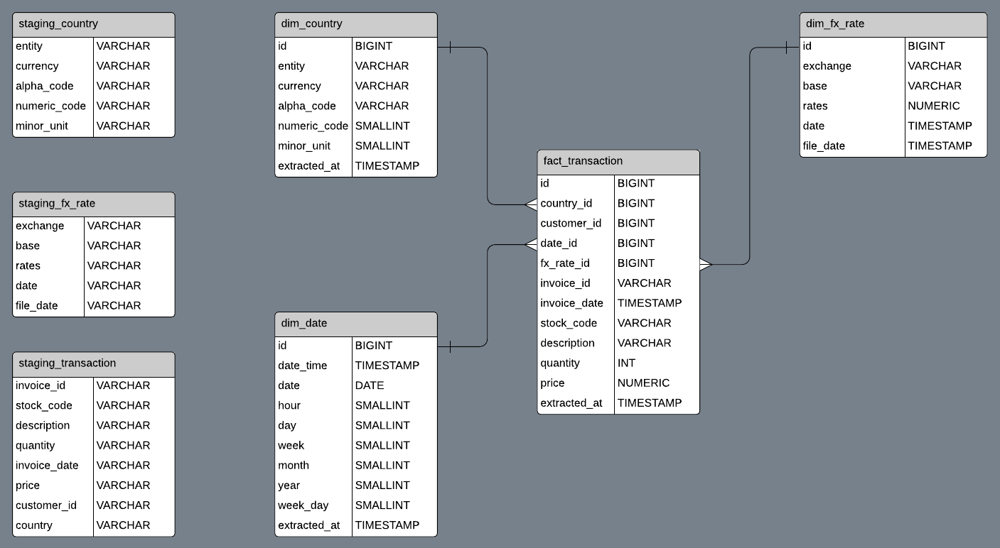

# Udacity Data Engineering Nanodegree - Capstone Project

## Project Scope and Data Gathering

In this project I wanted to simulate a situation I've encountered in the workplace, where daily transactions need to be enriched with data from other sources to enable analysis. To simulate this, I'm going to create a data pipeline which extracts daily transactions data, enriches it with currency exchange rates and loads the validated result to a data warehouse.

### Transaction Table
- Source: http://archive.ics.uci.edu/ml/datasets/Online+Retail+II

This is a dataset from the UCI Machine Learning Repository which contains just over a million transactions from an online business. Transaction lines are timestamped and grouped by `[invoice_id]`, each invoice can consist of one or more records containing product information, quantity and price. The `[country]` field of the **Transaction** table shows the name of the destination country of the invoice, with the help of an additional **Country** mapping table, I will lookup the local currency for each country.

### Country Table
- Source: https://www.currency-iso.org

This is a list of the world's countries and associated ISO currency information. I am going to use this table to lookup the `[alpha_code]` (currency code) for each of the records in the **Transaction** table by matching the country names and `[invoice_date]`.

### FX Rate Table
- Source: https://ratesapi.io

This free API serves current and historical currency exchange rate data from the European Central Bank. Using the `[invoice_date]` in the **Transaction** table and the `[alpha_code]` gained by cross-checking the `[country]` field, I will enrich the **Transactions** with currency exchange rates from this API.

## Explore and Assess the Data

### No Currency Fields in Transactions table
To apply the correct exchange rate to a record in the Transactions table, I need 3 pieces of information:
- Base currency
- Exchange currency
- Exchange date

#### Base Currency
From the information provided with the **Transaction** dataset, I know the online retailer only processes orders in GBP, so I don't need to worry about deriving a base currency.

#### Exchange Currency
The exchange currency will need to be derived from the `[country]` field which states the country the goods were sold to. The country names present in the **Transaction** table can be mapped to existing ISO country and currency tables found online, by matching the `[country]` names in the **Transaction** table with the `[entity]` names in the **Country** table, I can retrieve the `[alpha_code]`

A minor issue is that all of the country names in the **Country** table `[entity]` column are UPPERCASE, while the ones in the `[country]` field of the **Transaction** table are not. This is easily solved in the SQL statement which loads the transaction records, I'll convert the **Transaction** `[country]` column to UPPERCASE to match the **Country** `[entity]` column when performing the lookup. 

#### Exchange Date
While the **Transaction** table contains records for almost all dates, I was not aware that exchange rates are not available on weekends. If you call the exchange rate API on a weekend, it will return the rates from the preceding Friday. To avoid mismatching dates, I have added an additional column `[file_date]` to the **FX Rate** table which contains the date the exchange rate API was called with. With this column in place, I can reliably join the **Transaction** table to the **FX Rate** table on `[invoice_date]` = `[file_date]`.

### Non-null values in "empty" cells
The transactions table is not entirely clean and there are whitespace and other such non-null values in cells which should be null. I will use the COPY OPTIONS parameter when copying the data from S3 to Redshift; this parameter lets you specify how non-null values will be handled, in this case I will replace them with NULL.

### Long Decimal Values
The exchange rates returned by the FX Rate API are long decimal numbers. To ensure these values are not truncated, I've declared the scale and precision of these NUMERIC columns in the table definition.


## Step 3: Define the Data Model


From an analysis standpoint, this data model has been designed primarily to enable analysis of revenue over time in multiple currencies. In terms of the data pipeline, the model has been designed enable atomic runs, each `run` in the pipeline processes an isolated slice of data so many runs can be executed in parallel.

### dim_country
The `dim_country` table is a static mapping table used to lookup the currency for each country, it has been retained as part of the model due to the useful currency information fields it contains. For example, the `[minor_unit]` field can be used to drive calculations and the `[numeric_code]` could be useful to satisfy some reporting requirements.

### dim_date
The `dim_date` table is created by extracting a unique set of timestamps from the **Transactions** staging table. The timestamps are converted to UNIX epoch which serves as the PRIMARY KEY of the table, and further segmentations such as day, week, month are derived from it.

### dim_fx_rate
The `dim_fx_rate` table is created from the JSON the exchange rate API responds with. I use Pandas to convert the JSON response into a table and save it to S3 in CSV format, from there I use the Redshift `COPY` command to load the CSV file into a staging table.

### fact_transaction
Once the dimension tables are loaded, the associated FOREIGN KEYS are added to the staged **Transaction** data and inserted into the `fact_transaction` table. The country names are matched to join the `dim_country` table and the `dim_fx_rate` table is joined on currency code and file date. 

## Run ETL to Model the Data

The ETL process has been designed to be modular and atomic, a run on a particular date does not rely on the state of a run on another date. This is to ensure that I can have many ETL operations running in parallel, adding more Airflow workers as the size and complexity of the pipeline increases.

Each `run` in the pipeline executes over a single date and is comprised of the following operations:

### Extract
1. The ratesapi.io API is called to retrieve the **FX Rate** data.
2. The **FX Rate** data is saved to an S3 bucket.
3. The **Country**, **FX Rate** and **Transaction** data is copied from S3 to staging tables in Redshift.

### Ingest
The staged data is transformed into a dimensional model and loaded from the staging tables to permanent ones.

### Data Checks
Data quality checks are performed on the data model to ensure records are present. If no records exist in S3 for the run date, then the checks are skipped. To enable this, I've used Airflow's `xcom` feature to pass status variables between tasks in the run.

### Cleanup
If the data checks pass, the staging tables are dropped and the run completes successfully.


## Project Summary

### Project Goal
The goal of this project is to sequentially read date-partitioned transactional data from a data store, enrich it with currency exchange rates and store the enriched records in a data warehouse. The resulting data warehouse schema will be modelled to enable end-users to analyse transactions over time in base and customer currency.

### Choice of Technologies
#### Airflow
Airflow was chosen because it allows you to create complex pipelines of interdependent tasks in a concise and modular manner. Airflow includes many pre-built hooks and operators which make working with other cloud-based services straightforward and its rich github community provides a wealth of solutions to common problems.

With the Airflow UI, it is easy to inspect the status of running jobs, or the code which triggered an error in a failed job along with its stack trace. Your data pipelines are represented visually in the Graph View of the UI; this view will update as you make changes to your code, essentially giving you a live view of the structure which is invaluable when composing tasks. 

#### AWS Redshift and S3
AWS Redshift and S3 were chosen due to the seamless data transfer between them, the excellent APIs which make working with these resources straightforward and how well Airflow integrates them. The pre-built AWS operators and hooks Airflow ships with made connecting to these services quick and straightforward, which allowed me to concentrate on building and iterating the ETL process right away.

### Update Frequency
The transactions data has been partitioned to suit the grain of the currency exchange rate data; a single date. This means that each Airflow job will only deal with data for a specific date and can operate independently, enabling parallel processing. As the data is partitioned to single days, I propose the update frequency matches this.

### Scaling Scenarios
How you would approach the problem differently under the following scenarios:

#### If the data was increased by 100x.
I would increase the number of active runs Airflow processes, as each run is self-contained, multiple runs can execute in parallel. Redshift can be scaled horizontally by adding additional nodes or additional memory to existing nodes.

#### If the pipelines were run on a daily basis by 7am.
I would add an SLA to the Airflow DAGs in question, monitor how long it takes to process the jobs and make any required adjustments to the pipeline to ensure we consistently satisfy the SLA.

#### If the database needed to be accessed by 100+ people.
Redshift and S3 can easily handle 100+ users with varying levels of access. Adding many users will undoubtably introduce new use-cases for the data, it is worth revisiting the design of the data model to add additional views and tables specifically designed to serve the most common queries.


## Setup Instructions

### First Time Setup
This guide assumes that you have Python 3.7 and Airflow installed on a Linux operatoring system. When running this application for the first time, clone this github repo by running:

```bash
# clone github repo
git clone https://github.com/saur-dash/project_06__capstone_project.git
```

Navigate to the cloned repo and run the following commands to configure Airflow and install the required Python packages:

```bash
# set airflow home directory
export AIRFLOW_HOME=$(pwd)/airflow
```

```bash
# install required python packages
pip install -r requirements.txt
```

Enter the following commands to start Airflow:

```bash
# initialize the airflow database
airflow initdb
```

```bash
# start the web server on default port
airflow webserver -p 8080
```

```bash
# start the airflow scheduler
airflow scheduler
```
Once Airflow is running, the UI can be accessed at `http://localhost:8080`.

### Airflow Connections Setup
This application relies on **Connections** set within the Airflow UI, these will need to be set before starting the ETL process. Click **Admin**, then **Connections** to bring up the **Connections** manager. Next, click **Create** to create a new **Connection**, then enter each of the connections listed below:

#### AWS Credentials
- Conn Id: `aws_credentials`
- Conn Type: `Amazon Web Services`
- Login: `<Your AWS Access key ID>`
- Password: `<Your AWS Secret access key>`

#### FX Rates API
- Conn Id: `fx_rates_api`
- Conn Type: `HTTP`
- Host: `https://api.ratesapi.io`

#### Redshift Credentials
- Conn Id: `redshift`
- Conn Type: `Postgres`
- Host: `<Your Redshift cluster endpoint>`
- Schema: `dev`
- Login: `<Your Redshift username>`
- Password: `<Your Redshift password>`
- Port: `5439`

**Important!** The ETL process requires a schema named `public` in your Redshift cluster, please check that the schema exists before proceeding.

### Airflow Variables Setup
This application also requires an S3 bucket to write data to, these **Variables** also need to be set before running the ETL process. Click **Admin**, then **Variables** to bring up the **Variables** manager. Click **Create** and enter the **Variables** listed below:

#### s3_data_lake_bucket
- Key: `s3_data_lake_bucket`
- Value: `<Your S3 bucket name>`

#### s3_data_lake_region
- Key: `s3_data_lake_region`
- Value: `<Your S3 bucket region>`

**Important!** Your AWS role must allow read and write access to the S3 bucket you have specified, please check your permissions before proceeding.

### Running the ETL Process
Run the `transactions_etl` DAG by toggling the ON switch in the **DAGs** section of the Airflow UI. The ETL operation will proceed sequentially, a day at a time with a single active run, from `01/12/2009` to `09/12/2011`.

## Parallel Processing
If you would like to process multiple runs in parallel, increase the number of active runs in the `etl_transactions.py` DAG after confirming the first run has completed successfully in the Airflow UI. Changing the number of active runs in the DAG will be reflected in the Airflow UI once the file is saved, there is no need to restart the webserver.

## Example SQL Query

### Multi-Currency Transaction Report
```sql
SELECT t.id                                       AS transaction_id,
	     d.date_time :: DATE                        AS invoice_date,
	     t.stock_code                               AS stock_code,
       t.description                              AS description,
       'GBP'                                      AS base_currency,
       f.exchange                                 AS local_currency,
       f.rates                                    AS local_exchange_rate,
       t.quantity                                 AS unit_quantity,
       t.price                                    AS base_unit_price,
       ROUND(t.price * f.rates, 2)                AS local_unit_price,
       t.price * t.quantity                       AS total_base_price,
       ROUND((t.price * f.rates) * t.quantity, 2) AS total_local_price
FROM public.fact_transaction t
JOIN dim_date d
  ON d.id = t.date_id
JOIN dim_fx_rate f
  ON f.id = t.fx_rate_id
WHERE invoice_date >= '2010-01-01'
  AND invoice_date < '2010-02-01';
```

### Report Output

